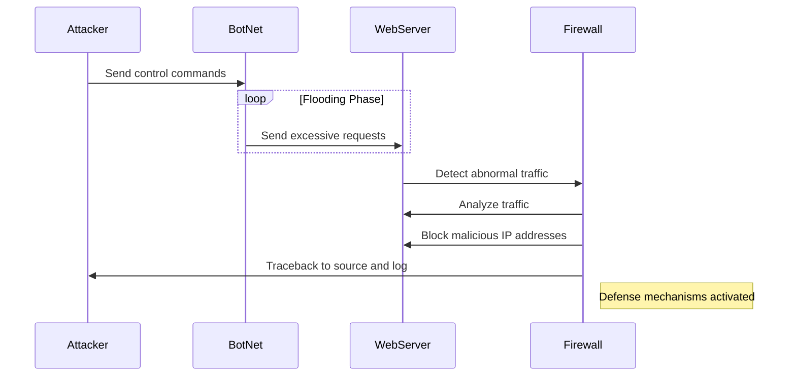

## _Markdown Documentation_

#### **Attacker Command**
- The attacker sends commands to the botnet, instructing compromised systems to begin flooding the web server with requests.

#### **BotNet Flooding**
- The botnet initiates the attack, overwhelming the web server with excessive requests designed to mimic legitimate traffic.

#### **Detection Phase**
- The web server detects abnormal traffic patterns and alerts the firewall to investigate.

#### **Defensive Response**
- Upon receiving the alert:
  - The firewall analyzes traffic patterns to differentiate between malicious and legitimate requests.
  - Malicious IPs are identified and blocked to reduce the server load.
  - The firewall attempts to trace back the source of the attack to the attacker.

#### **Outcome**
- Defensive measures mitigate the attack, ensuring the server remains operational for legitimate users.

